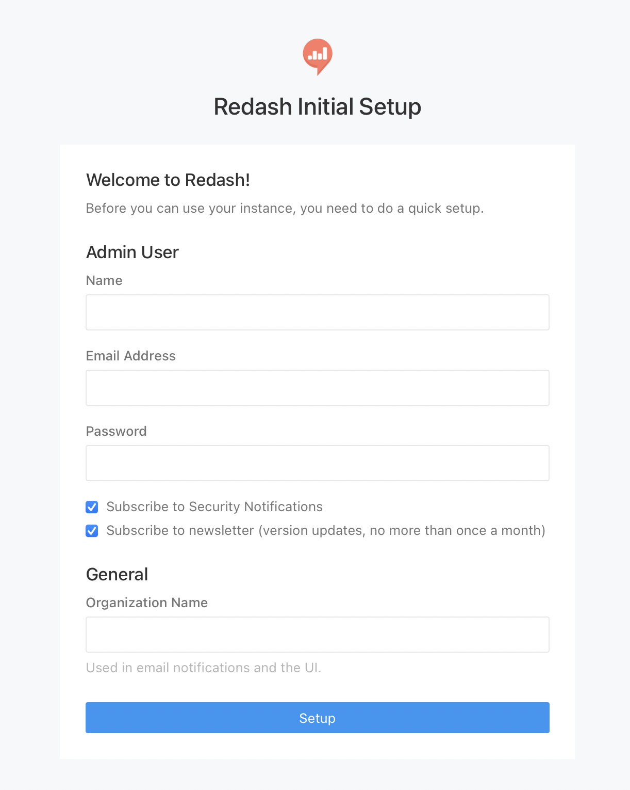

# redash_for_arm64
Redash docker images and docker-compose for ARM64

## Usage

Docker image is already available on [this docker image repo](https://github.com/ktmrmshk/redash_for_arm64/pkgs/container/redash_arm64), so that you can start up by just downloading the setup script(`setup.py`) and `docker-compose.yml` and spinning up the docker containers by docker-compose. These scripts are based on original one in [the redash git repository](https://github.com/getredash/redash) and modified to match ARM64 enviroment. If you want to learn more, check out this repository and original repo and diff them according to later section.

### Prerequisite

* PC environment of ARM64 (M1 mac, graviton2, Ampere Altra, raspberry pi etc...)
* Docker
* docker-compose
* `pwgen` command

### Installation

1. download scripts

```bash
$ git clone https://github.com/ktmrmshk/redash_for_arm64.git
$ cd redash_for_arm64/setup
$ ls 
data  setup.sh
```


2. run `setup.py`

By this `setup.py`, some directories made at `/opt/redash/` and env vals are defined and set to `~/.profile`.

```bash
$ source  setup.sh

$ printenv
...
COMPOSE_FILE=/opt/redash/docker-compose.yml
COMPOSE_PROJECT_NAME=redash
...
...
```

3. run docker-compose up

```bash
$ sudo cp data/docker-compose.yml /opt/redash/

$ cd /opt/redash/

$ docker-compose run --rm server create_db

$ docker-compose up -d
```

4. access to this host with port=5000

The docker container of redash web service are listening at port 5000.
Access to the this host with port=5000 in the browser. i.e. `http://localhost:5000`.




## Building a docker image from source

On how this docker image are built.

```bash
## clone original repo
$ git clone https://github.com/getredash/redash.git

## clone this repo which includes files for docker-build on ARM64
$ git clone https://github.com/ktmrmshk/redash_for_arm64.git

## copy files needed ( or replace it with original ones)
$ cp redash_for_arm64/redash/* redash/

## check the files
$ cd redash
$ ls -l
...
-rw-rw-r--  1 ubuntu docker   3306 Jan  9 14:11 Dockerfile
-rw-rw-r--  1 ubuntu docker   3402 Jan  9 14:12 Dockerfile_arm64
...
-rw-rw-r--  1 ubuntu docker   1684 Jan  9 14:11 requirements.txt
-rw-rw-r--  1 ubuntu docker   1670 Jan  9 14:12 requirements_arm64.txt
-rw-rw-r--  1 ubuntu docker    823 Jan  9 14:11 requirements_all_ds.txt
-rw-rw-r--  1 ubuntu docker    833 Jan  9 14:12 requirements_all_ds_arm64.txt
...

## docker build
$ docker build -t ghcr.io/ktmrmshk/redash_arm64:latest -f Dockerfile_arm64 .

## check after build
$ docker images
REPOSITORY                      TAG               IMAGE ID       CREATED         SIZE
ghcr.io/ktmrmshk/redash_arm64   latest            de80d066a8e6   6 hours ago     1.1GB
```


